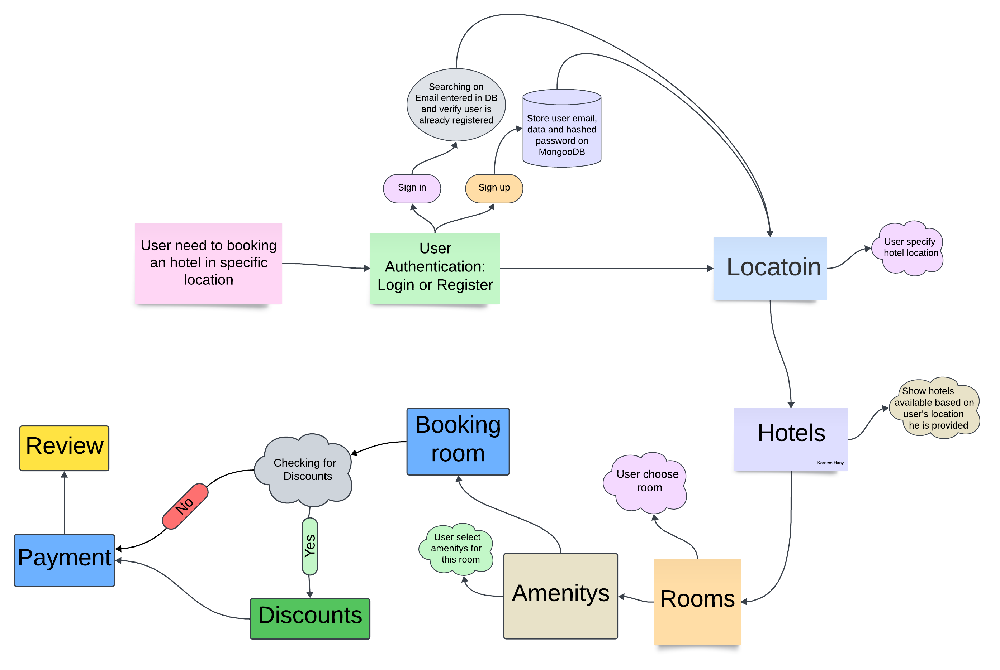
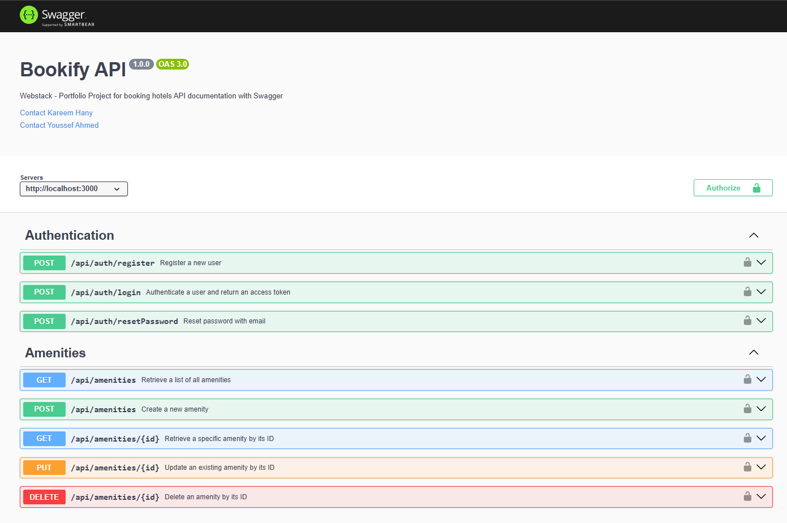
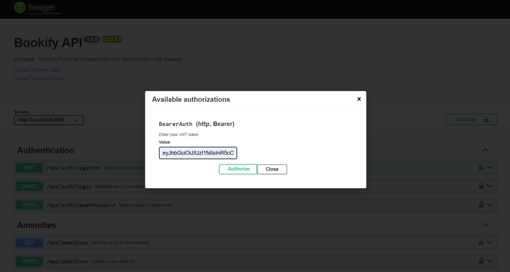

# <p align=center>Ｂｏｏｋｉｆｙ</p>
Bookify is a backend project for booking hotels based on a specific location. In this project, we built an API with Node.js and documented these APIs with Swagger.

## 📖 Table of Contents

- [Features](#features)
- [Technology Stack](#technology-stack)
- [Installation](#installation)
- [Usage](#usage)
- [Tests](#tests)
- [Documentation](#documentation)
- [License](#license)
- [Git Flow](#git-flow)
- [Screenshots](#screenshots)
- [Authors](#authors)


## 💡 Features

- [x] User authentication (register, login, reset password)
- [x] User can specify location for the room
- [x] User can booking room based on specific location
- [x] User can select amenitys for this room
- [x] User can payment with stripe
- [x] finally user can review the room

## 🛠️ Technology Stack

- **Backend:** Node.js, Express.js
- **Database:** MongoDB
- **Authentication:** JWT (JSON Web Tokens)
- **Payment Integration:** Stripe
- **Documentation:** Swagger

## 💠 Installation

1. **Clone the Repository**
    
    ```shell
    git clone https://github.com/youssef3092004/Portfolio-js.git
    ```
        
2. **Install Dependencies**
    
    ```shell
    npm install
    ```
    
3. **⚙ Set Up Environment Variables** 
Copy the `.env.example` file to `.env` and fill in the necessary environment variables like JWT_SECRET.
    
    ```shell
    cp .env.example .env
    ```
    > **Note**: The .env file is used to configure the project. Ensure you provide the required values for the environment variables listed in the .env.example.
        
4. **Run the backend server**
    
    ```shell
    npm run dev
    ```
        
5. **Open Swagger api documentation**
    
    Navigate to [http://localhost:3000/api-docs](http://localhost:3000/api-docs) in your browser to see api documentations and test it.

    > Tip: You can also test endpoints using *Postman*.

## 💠 Usage

1. **Authentication:** Create an account and log in.
2. **Browse Hotels:** Search hotels based on location.
3. **Select Amenities:** Choose room features and amenities.
4. **Make Payment:** Complete the booking using Stripe.
5. **Review Rooms:** Share your experience by submitting a review.

## 🧪 Tests
We have implemented unit tests to ensure all endpoints are reliable, secure, and capable of handling edge cases.

```bash 
npm run test
```

## 📝Documentation
We document the API with Swagger, providing clear and interactive documentation for all endpoints, request parameters, and responses. This ensures easy access and understanding for developers.

## 📜License

This project is licensed under the MIT License. See the [LICENSE](https://github.com/youssef3092004/Portfolio-js/blob/dev/LICENSE) file for more details.

## 🔄 Git Flow
We follow an organized Git Flow for development:

**dev:** Main development branch.

**feature/branch:** Each feature is developed in separate branches created from dev.

**main:** Stable production branch.

**hotfix/branch:** Critical fixes branched from main.

## 📸 Screenshots

***Project Flow Diagram:***

---
***Endpoints Overview:***

---
***User Authentication Required: Access endpoints securely by logging in with a valid JWT token.***


## 👨‍💻 Authors

-  Kareem Hany - Backend Developer  ([LinkedIn](https://www.linkedin.com/in/kareemhany/)) 
- Youssef Ahmed - Backend Developer ([LinkedIn](https://www.linkedin.com/in/youssef-ahmed-046072254/)) 

---

### <p align=center> *💬 Thank you for exploring Bookify! Feel free to contribute or share your feedback.* </p>
